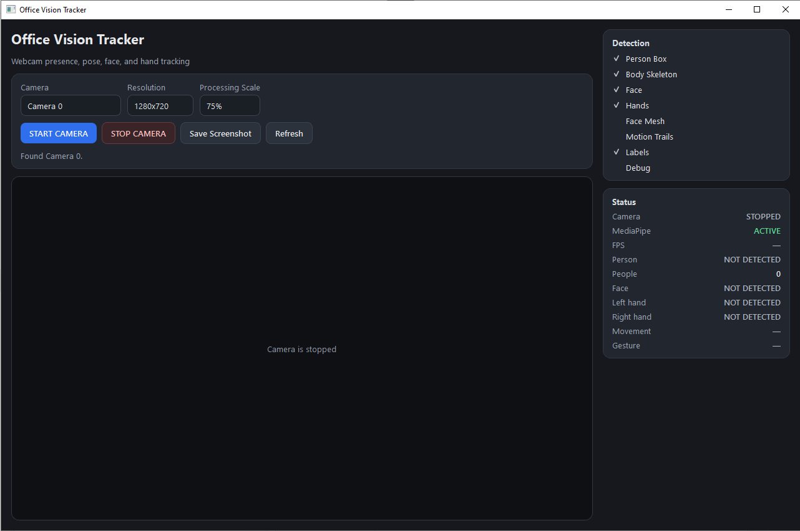
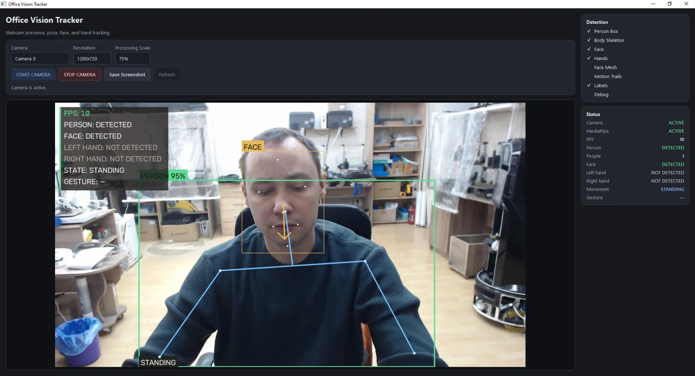
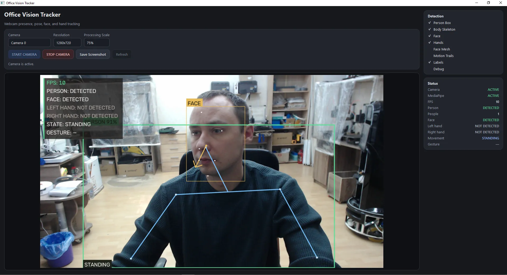
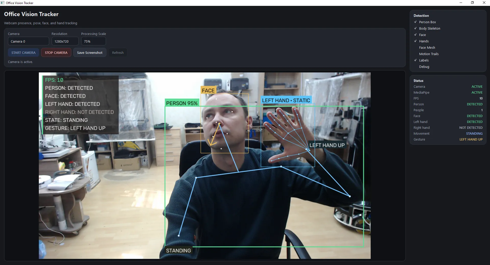
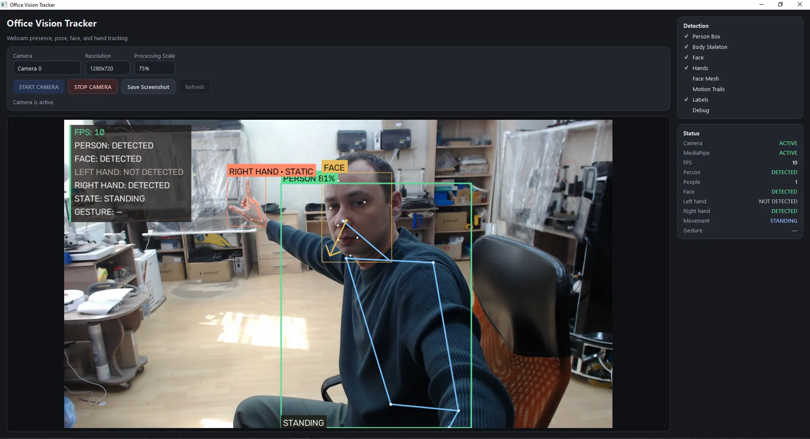

# Office Vision Tracker

A local Windows computer-vision application for real-time webcam tracking of a person, body pose, face, hands, movement and simple gestures.



## Overview

Office Vision Tracker was developed as a practical desktop application around the **Google MediaPipe Tasks Vision / Holistic Landmarker** computer-vision stack. The MediaPipe model provides the underlying pose, face and hand landmarks; this project adds the complete Windows application layer around that vision core: webcam management, threaded processing, smoothing and persistence, bounding boxes, skeleton rendering, face direction, hand tracking, motion analysis, gesture logic, status diagnostics, screenshots and a PySide6 user interface.

The project is not a fork of the MediaPipe application itself. It uses the public MediaPipe Tasks APIs and model topology as the underlying computer-vision technology and implements its own application architecture and tracking logic around those outputs.

**Upstream computer-vision foundation:**  
[Google MediaPipe](https://github.com/google-ai-edge/mediapipe) — Apache License 2.0.

## Demonstration

The following frames were captured from the running application.

### Person, pose and face tracking



### Head direction tracking



### Left-hand gesture detection



### Right-hand gesture detection



## What the application does

- opens a USB/web camera through OpenCV;
- runs MediaPipe Holistic Landmarker locally;
- tracks one person in the frame;
- returns and renders 33 body landmarks;
- returns and analyzes 478 face landmarks;
- returns 21 landmarks for each detected hand;
- calculates a person bounding box from body landmarks;
- smooths landmarks and boxes with EMA filtering;
- keeps tracks alive briefly when a detection is lost for a few frames;
- estimates face direction;
- distinguishes standing from body movement;
- estimates left/right movement;
- approximately estimates forward/backward movement from shoulder-width changes;
- detects raised left, right and both hands;
- classifies each hand as moving or static;
- displays optional motion trails;
- provides layer controls for person box, skeleton, face, hands, face mesh, trails, labels and debug information;
- runs camera capture and MediaPipe processing in a background `QThread` so the GUI remains responsive;
- saves annotated screenshots to disk.

## Why Holistic Landmarker

Earlier experiments with independent full-frame Pose, Face and Hand Landmarker pipelines required several separate inference passes. This application instead uses **MediaPipe Holistic Landmarker**, which returns pose, face and both hands from one graph.

That gives a single synchronized result containing:

- 33 pose landmarks;
- 478 face landmarks;
- 21 left-hand landmarks;
- 21 right-hand landmarks.

The model is used in `VIDEO` mode so tracking information is carried between frames.

## Interface

The GUI is built with **PySide6** and provides:

- camera selection;
- 640×480, 1280×720 and 1920×1080 resolutions;
- processing scale controls;
- camera start/stop;
- camera refresh;
- screenshot saving;
- detection-layer switches;
- live status for camera and MediaPipe;
- FPS;
- person count;
- face/hand status;
- movement state;
- detected gesture.

The preview remains at the selected camera resolution while MediaPipe can process a reduced copy of the frame. Because MediaPipe landmarks are normalized, the coordinates are mapped back to the original preview size.

## Gesture detection

Gesture state is calculated from body landmarks rather than from a separate cloud service.

Implemented states include:

- `LEFT HAND UP`
- `RIGHT HAND UP`
- `BOTH HANDS UP`
- `ARMS DOWN`

A gesture must remain stable for several frames before the displayed state changes, reducing single-frame false transitions.

## Motion analysis

Body movement is estimated from the center of the tracked person box and shoulder width:

- `STANDING`
- `MOVING LEFT`
- `MOVING RIGHT`
- `MOVING FORWARD`
- `MOVING BACKWARD`
- `MOVING`

Forward/backward motion is only an approximation from a monocular camera and is not a true depth measurement.

Each hand is also analyzed independently and can be labeled `HAND MOVING` or `HAND STATIC`.

## Smoothing and persistence

The project uses exponential moving-average smoothing for landmark coordinates and bounding boxes.

Typical defaults:

| Parameter | Default |
| --- | ---: |
| Smoothing alpha | 0.6 |
| Lost-frame timeout | 5 frames |
| Pose confidence threshold | 0.5 |
| Hand confidence threshold | 0.5 |
| Face confidence threshold | 0.5 |

These values can be changed in `app/settings.py`.

## Project structure

```text
Office-Vision-Tracker/
├── main.py
├── requirements.txt
├── install.bat
├── start.bat
├── download_models.py
├── app/
│   ├── main_window.py
│   ├── camera_worker.py
│   └── settings.py
├── vision/
│   ├── mediapipe_engine.py
│   ├── pose_tracker.py
│   ├── face_tracker.py
│   ├── hand_tracker.py
│   ├── motion_tracker.py
│   ├── gesture_analyzer.py
│   ├── drawing.py
│   ├── smoothing.py
│   ├── connections.py
│   └── types.py
├── models/
├── screenshots/
├── logs/
└── docs/images/
```

## Installation

Supported environment:

- Windows 10 / Windows 11
- Python 3.10–3.12
- USB or integrated webcam

Run:

```bat
install.bat
```

The installer creates a virtual environment, installs the pinned Python dependencies and downloads the MediaPipe Holistic Landmarker model if it is not already present.

The model file is **not stored in this GitHub repository**. It is downloaded from Google's MediaPipe model storage by `download_models.py`.

Then start the program with:

```bat
start.bat
```

Or manually:

```bat
venv\Scripts\activate.bat
python main.py
```

## Dependencies

The verified Python stack in this version includes:

- PySide6
- NumPy
- OpenCV Contrib
- MediaPipe

See `requirements.txt` for pinned versions.

> Do not install `opencv-python` and `opencv-contrib-python` into the same environment. Both provide the `cv2` module and can overwrite one another.

## Local processing and privacy

All live computer-vision inference is performed locally on the machine after installation.

Camera frames are not sent to a cloud API by this application. Internet access is only required during installation when Python packages and the MediaPipe model need to be downloaded.

Screenshots are only written when the user explicitly presses **Save Screenshot**.

## Extending the project

The architecture separates vision processing from the GUI, making it possible to add:

- more gestures;
- additional movement states;
- video recording;
- event logging;
- robot/automation triggers;
- local assistant integration;
- network or API output;
- additional computer-vision backends.

`CameraWorker.frame_ready` is the intended extension point for consuming already-annotated frames without opening the camera a second time.

## License

The application source code in this repository is released under the **Apache License 2.0**. See [LICENSE](LICENSE).

Third-party components remain under their respective licenses. In particular:

- **MediaPipe** — Apache License 2.0;
- **OpenCV** — Apache License 2.0;
- **NumPy** — BSD-3-Clause;
- **PySide6 / Qt for Python** — LGPLv3 / GPLv3 / commercial licensing options.

See [THIRD_PARTY_LICENSES.md](THIRD_PARTY_LICENSES.md) for details.

## Attribution

Computer-vision functionality is built on the public **Google MediaPipe Tasks Vision / Holistic Landmarker** APIs and model. MediaPipe is a Google project and is not affiliated with this repository.

The custom application code in this repository implements the desktop GUI, camera worker, tracking state, smoothing, bounding-box logic, drawing system, gesture/motion analysis, status UI and Windows installation workflow.

## Notes

This is a computer-vision prototype and engineering tool. Detection confidence and gesture/motion estimates depend on camera quality, lighting, occlusion, subject distance and pose.
